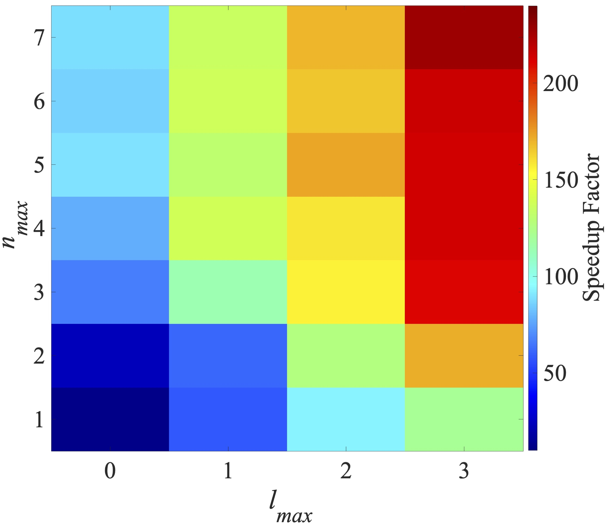

# cuSOAP

GPU-accelerated generator of the Smooth Overlap of Atomic Positions (SOAP)
descriptor, implemented in PyTorch with fused Triton (PTX) kernels. The API and
feature ordering are compatible with DScribe's `SOAP`.

On a 3,000-atom system, the fused Triton pipeline generates SOAP vectors and their derivatives about
250x faster than DScribe on a single GPU.

## Features

- DScribe-like `SOAP(...)` constructor and `.create()` / `.derivatives()` API
- GTO and polynomial radial bases, weighting functions, periodic systems,
  all DScribe averaging modes plus `average="cc"` (projection coefficients,
  used for force prediction)
- Fused Triton kernels for neighbor search, real spherical harmonics, and
  density-coefficient accumulation (falls back to pure PyTorch when Triton or
  a GPU is unavailable, e.g. on CPU-only machines)
- Derivatives with respect to atomic coordinates:
  - `method="analytical"`: exact derivatives (autograd and closed-form paths)
  - `method="numerical"`: central finite differences
- Multi-GPU generation via `torch.multiprocessing` (see `examples/test_mp.py`)

## Installation

Install the Pytorch package corresponding to your operating system and CUDA version if NVIDIA GPUs are available.

For example, on the Texas Advanced Computing Center's Horizon cluster, the installation of CUDA-enabled Pytorch can be accomplished by the following commands: 

```bash
module purge
module reset
module load gcc/15.3.0
module load cuda/13.2

export TORCH_CUDA_ARCH_LIST="8.9 9.0 10.0 11.0 10.3 12.0 12.1"
export ENVNAME=cudasoapenv

cds
rm -rf $ENVNAME
python3 -m venv $ENVNAME && source $ENVNAME/bin/activate

pip3 cache purge
python3 -m pip install --upgrade pip
python3 -m pip install --upgrade setuptools
pip3 install torch==2.14.0 torchvision==0.28.0 --index-url https://download.pytorch.org/whl/cu132

git clone https://github.com/lab-cosmo/sphericart
cd sphericart
pip3 install .[torch]
cd ..

git clone https://github.com/SINGROUP/dscribe.git
cd dscribe
git submodule update --init
pip3 install .
cd ..

git clone https://github.com/TACC/cuSOAP
cd cuSOAP
pip3 install .
cd ..
```

Requirements: Python >= 3.9, PyTorch >= 2.0, sphericart + sphericart-torch, ASE.
On Linux + CUDA, Triton is bundled with PyTorch. Optional: `torch_cluster` for a
faster neighbor search on GPU.

## Quickstart

```python
from cusoap import SOAP
from ase.io import read

soap = SOAP(
    species=["H", "O"],
    r_cut=10.0,
    n_max=7,
    l_max=3,
    periodic=False,
    average="outer",   # or "off", "inner", "cc"
)

molecule = read("water.xyz", format="xyz")
descriptor = soap.create(molecule)
derivatives = soap.derivatives(molecule, method="analytical", return_descriptor=False)
```

## Examples

```bash
python3 examples/test_serial.py examples/water.xyz    # single CPU/GPU
python3 examples/test_mp.py examples/water.xyz 4      # one worker per GPU
```

## Single-GPU Performance

Speedup factor of cuSOAP over DSCribe for the generation of the atom-wise SOAP vectors and their derivatives for (H<sub>2</sub>O)<sub>1000</sub> clusters, as a function of the radial basis size, <i>n<sub>max</sub>=1-7<\i> and the angular band limit <i>l<sub>max</sub>=0-3<\i>. 

## Citation

cuSOAP: a GPU-accelerated Generator of Smooth Overlap of Atomic Positions
Descriptor (manuscript in preparation).
